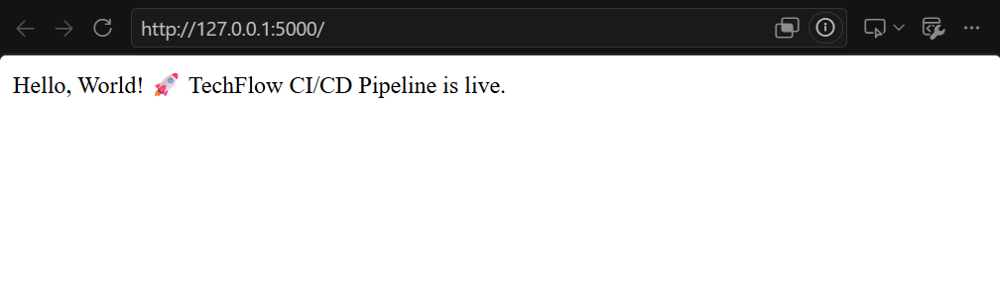

## Running the App Locally

### Prerequisites

- Python 3.13 (or the version specified in your CI workflow)
- `pip` package manager
- Git

### 1. Fork the repository

```bash
Repo: https://github.com/Dcoder21/Techflow-Project
cd Techflow-Project
```

### 2. Create and activate a virtual environment

It's good practice to isolate dependencies in a virtual environment rather than installing packages globally.

**macOS / Linux:**
```bash
python3 -m venv venv
source venv/bin/activate
```

**Windows (PowerShell):**
```powershell
python -m venv venv
venv\Scripts\Activate.ps1
```

You'll know it worked if your terminal prompt now shows `(venv)` at the start of the line.

### 3. Install dependencies

```bash
pip install -r requirements.txt
python -m pip install --upgrade pip
```

### 4. Run the test suite (optional, but recommended)

```bash
pytest test_app.py -v
```

This runs the same tests that execute automatically in the CI pipeline before any deployment.

### 5. Start the app

```bash
python app.py
```

By default, the app should be reachable at:

```
http://localhost:5000

```
Running App on Local Browser



### 6. Verify it's running

```bash
curl http://localhost:5000/health
```

A healthy response should return HTTP status `200`.

### Stopping the app

Press `Ctrl+C` in the terminal where it's running.

### Deactivating the virtual environment

```bash
deactivate
```

